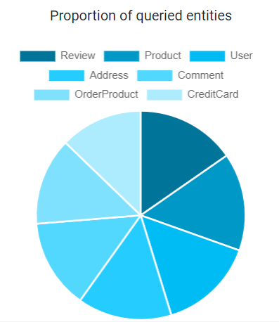
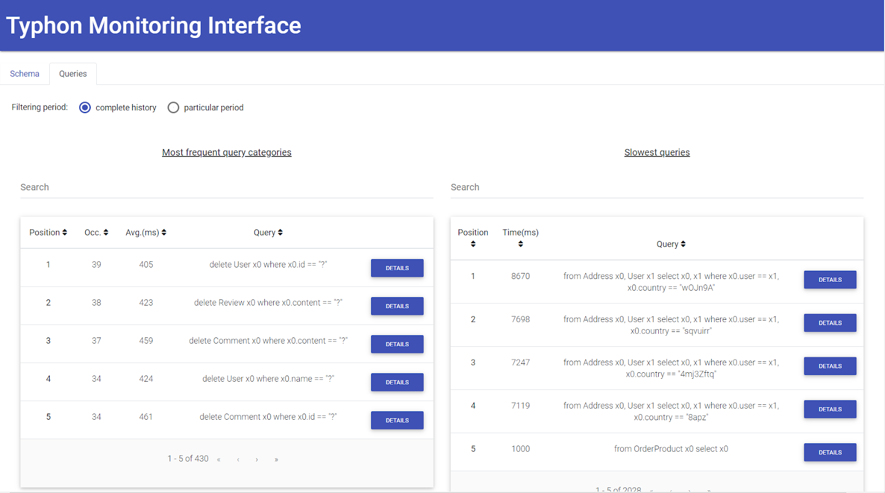
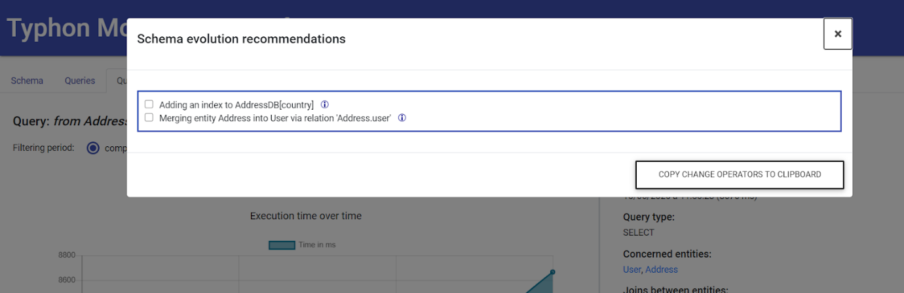
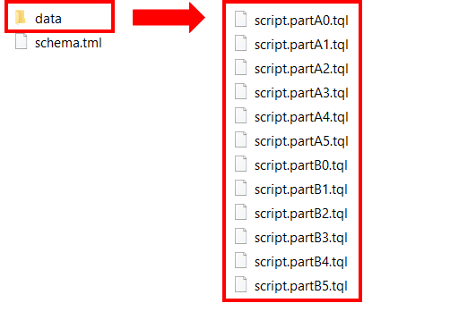

[](http://typhon.clmsuk.com:8080/job/TyphonEvolution)

# Typhon evolution tools

In the context of its Work Package 6, the Typhon project aims to develop a method and a technical infrastructure to support the graceful evolution of hybrid polystores, where multiple NoSQL and SQL databases may jointly evolve in a consistent manner.

This repository contains the different tools aiming to support the evolution of such hybrid polystores. The tools are the following:

- [Schema and data evolution/migration (D6.3)](#schema-and-data-evolutionmigration) : A command line tool enabling you to (1) evolve the TyphonML polystore schema and (2) migrate the data from one polystore schema version to another;
- [Query evolution (D6.4)](#query-evolution) : An Eclipse plugin allowing users to adapt TyphonQL queries to an evolving  TyphonML polystore schema;
- [Polystore Continuous Evolution (D6.5)](#polystore-continuous-evolution) : An interface enabling one to monitor the polystore query events in order to provide users with polystore evolution recommendations, when relevant;
- [Data Ingestion (D6.5)](#data-ingestion) : A Java plugin allowing users to ingest data from pre-existing relational databases to a new Typhon polystore.


The instruction for installing and using each of these tools are explicited in the following sections.

## Schema and data evolution/migration

This command-line tool enabling you to (1) evolve the TyphonML polystore schema and (2) migrate the data from one polystore schema version to another.

You can access the source code [here](https://github.com/typhon-project/typhon-evolution/tree/master/backend)

To execute the application:

1)	Download the jar from: http://typhon.clmsuk.com/static/evolution-tool.jar

2)  For the first usage:

- Run the jar with the command: java -jar evolution-tool.jar
- Open the automatically created “application.properties” file and check the configuration. The properties should contain the input and result XMI files paths for the evolution operators you would like to execute. The following properties are the most important to check/fill (“RESULT_FILE” corresponding file can be empty, and will be populated with the evolution tool):
```
INPUT_XMI=addAttribute.xmi
POLYSTORE_API_USER_PASSWORD=admin\:admin1@
RESULT_FILE=addAttribute_result.xmi
POLYSTORE_API_URL=http\://localhost\:8080/
```

- Run again the command: java -jar evolution-tool.jar

3)	For next usages:

- Open the “application.properties” file and replace the input and result XMI files paths for the evolution operators you would like to execute. For example:
```
INPUT_XMI=removeAttribute.xmi
RESULT_FILE=removeAttribute_result.xmi
```
- Run the command: java -jar evolution-tool.jar

To create the input XMI file, you should use the TyphonML Eclipse-based textual or graphical editors on the TML schema file. Regarding the use of the graphical editor, we refer to the TyphonML documentation. Below, you can find the TML textual syntax for the  evolution operators supported by the polystore schema and data evolution/migration tool:

•	**Add attribute**:
```
  changeOperators [
	AddPrimitiveDataTypeAttribute newPrimitiveAttribute {
		ownerEntity Test type bigint
	},
	AddCustomDataTypeAttribute newCustomAttribute {
		ownerEntity Test type customType
	}
]
```
•	**Add entity**:
```
relationaldb RelationalDatabase {
    tables {
        table {
            Test2Table : Test2
        }
    }
}
changeOperators [
add entity Test2 {
		attributes [
			testDate: date,
			testBool: bool
		]
	}
]
```

•	**Add relation**:
```
	changeOperators [
		add relation newRelation to Test -> Test2
]
```

•	**Rename attribute**:
```
	changeOperators [
		rename attribute 'Test.id' as 'identifier'
]
```

•	**Rename entity**:
```
	changeOperators [
		rename entity Test as 'TestNewName'
]
```

•	**Rename relation**:
```
	changeOperators [
		rename relation newRelation as 'newRelationName'
]
```

•	**Remove attribute**:
```
	changeOperators [
		remove attribute 'Test.id’
]
```

•	**Remove entity**:
```
	changeOperators [
		remove entity Test2
]
```

•	**Remove relation**:
```
	changeOperators [
		remove relation newRelation
]
```

•	**Migrate entity**: migrate an entity from one database to another. Hypothesis: the incoming relations (relations pointing to the migrated entity) will be lost.
```
	changeOperators [
		migrate Test to DocumentDatabase
]
```

•	**Merge entities**: merge 2 entities using the “as” for the relation name. Hypothesis: the relation between the 2 entities is 1-1.
```
  changeOperators [
		merge entities Test Test2 as 'Test2.relationName'
]
```

•	**Split entity vertical**: split an entity into 2 entities. The attributes specified as input will be moved from the first (existing) entity to the second (new) entity.
```
	changeOperators [
		split entity vertical Test2 to Test3 attributes: [ "Test2.testBool" ]
]
```

•	**Split entity horizontal**: split an entity into 2 entities. The where clause contains the attribute and the value on which the split is applied. The result data of the where clause will be contained in the second (new) entity. Both entities will have the same attributes.
```
	changeOperators [
		split entity horizontal Test2 to Test3 where "Test2.testBool" value "true"
]
```

•	**Enable relation containment**:
```
	changeOperators [
		EnableRelationContainment { relation newRelation }
]
```

•	**Disable relation containment**:
```
	changeOperators [
		DisableRelationContainment { relation newRelation }
]
```

•	**Enable relation opposite**:
```
	changeOperators [
		EnableBidirectionalRelation { relation newRelation }
]
```

•	**Disable relation opposite**:
```
	changeOperators [
		DisableBidirectionalRelation { relation newRelation }
]
```

•	**Change attribute type**:
```
	changeOperators [
		ChangePrimitiveDataTypeAttribute { attributeToChange "Test.id" newType bigint },
		ChangeCustomDataTypeAttribute { attributeToChange "Test.id" newType customType }
]
```

Once the desired evolution operators have been specified using the Eclipse-based editors (textual or graphical) you can generate the corresponding XMI file by using the Eclipse TML plugin (right-click on the TML file, then “Typhon” and “Inject to model” buttons).


Once the full XMI file is generated, you can use it as input of the schema and data evolution/migration tool, by providing the path to the XMI file in the “application.properties” file.

Log messages are provided in the console where you run the schema/data evolution tool. The output of the evolution tool is the XMI file referenced in the “application.properties” file, under the “RESULT_FILE” property. In addition to the target polystore schema produced as output, the polystore data structures and database contents have been modified according to the desired evolution operators.

## Query evolution

The Query Evolution Tool is a plugin for Eclipse helping the developers to identify TyphonQL queries impacted by a change in the polystore schema, and to automatically adapt those queries to the target polystore schema, when possible. This section will cover the installation and the usage of the query evolution plugin.

You can access the source code [here](https://github.com/typhon-project/typhon-evolution/tree/master/plugin-evolution)

### Installation

The eclipse repository for this sub-project is : http://typhon.clmsuk.com:8082/typhon-evolution/repository

### Overview

The plugin introduces a new kind of file with the extension ‘.qevo’. An evolution file is made of two-part :

-	Schema to Apply: A line referencing the schema used to evolve the polystore.
-	Query List: The TyphonQL queries to evolve separated by a comma.

Here is a minimal example of .qevo file :

```
apply ./src/xmi/addRelationChangeOperator.xmi;
from Order o select o,
from Order o select o.id,
delete User u where u.id == 42
```

Applying the Query Evolution process to a .qevo file will assign a status to each output TyphonQL query. There is 4 different status:

- **UNCHANGED**: the input query has not been changed since it remains valid with respect to the target schema;
-	**MODIFIED**: the input query has been transformed into an equivalent output query, expressed on top of the target schema;
-	**WARNING**: the output query (be it unchanged or modified) is valid with respect to the target schema, but it may return a different result set;
-	**BROKEN**: the input query has become invalid, but it cannot be transformed into an equivalent query expressed on top of the target schema.

Queries with the status WARNING or BROKEN are also accompanied by a comment explaining which change operator causes them to take that status and why.

Here is an example of .qevo file after the query evolution process:

```
apply ./src/xmi/addRelationChangeOperator.xmi;

WARNING
#@ Attribute users added to Order. Result of the query may have changed @#
from Order o select o,

WARNING
#@ Attribute users added to Order. Result of the query may have changed @#
from Order o select o.id,

UNCHANGED
delete User u where u.id == 42
```

### Usage

Once the plugin is installed, create a new text file with the extension ‘.qevo’ in your project. The first line of this file should be the path of the xmi file containing the schema and the change operator (the same file expected by the schema evolution tool). The syntax  of this line is :

```
apply <path>;
```

where the path is relative to the root of your eclipse project.

After the ‘apply’ line you can copy paste the query you want to evolve separated by comma. (cf fig below)


When all your queries are in the evolution file, you can apply the transformation by right clicking in the editors and select **query evolution -> evolve**.


The plugin will rewrite the .qevo file with the evolved queries:


The updated queries could then be reused in the source code of the developers.

## Polystore Continuous Evolution

The continuous evolution tool aims to monitor data usage performance in a Typhon polystore in order to provide users with schema evolution recommendations, when relevant.

The tool communicates with several polystore components, including the post-execution events queue (WP5) and, through the polystore API, the polystore TyphonML schema (WP2) and the polystore databases (WP3 and WP4). This allows the continuous evolution to automatically retrieve useful information about the polystore, including:

- the polystore configuration, i.e., the TyphonML entities and their mapping to underlying native databases;
- the TyphonQL queries that are executed by the TyphonQL engine, and their duration;
-	the (evolving) size of the TyphonML entities over time.

### Overview

The general architecture of the continuous evolution tool is depicted in Figure below. Each time a post-execution event is published to the post-event queue, a Java application wakes up and retrieves the event. If the event corresponds to a DML query execution, the Java application sends the corresponding TyphonQL query to a Rascal plugin. The latter parses, analyses and classifies the query and sends back the corresponding query information to the Java application. This information is stored in an internal MongoDB database, that is used as input by an interactive web application. The web application, relying on an Angular frontend and a Node.js backend, provides users with visual analytics of the polystore data usage, as well as with performance-based schema reconfiguration recommendations. Each of these steps is described in further details in the remaining of this section.


### Step 1: Capturing TyphonQL queries

The continuous evolution tool exploits the polystore monitoring mechanisms developed in Work Package 5. Thanks to those mechanisms, the tool can capture at runtime the successive TyphonQL queries that are sent to the polystore, and executed by the TyphonQL engine. To do so, the tool consumes and analyses the so-called post-execution events (PostEvent), generated and pushed by the TyphonQL engine to the analytics queue of the WP5 monitoring infrastructure. We refer to deliverable D5.3 for more details about this infrastructure.

### Step 2: Parsing and classifying TyphonQL queries

The post-execution events captured at Step 1 include the TyphonQL queries that have been executed by the TyphonQL engine. The continuous evolution tool parses each of those queries, in order to extract relevant information to be used during the analytics and recommendation phases. Our tool focuses on post-execution events corresponding to DML queries, i.e., select, insert, delete, and update queries. It ignores other events such as, for instance, the execution of DDL queries (e.g., create entity, delete entity, etc.) sent by the schema evolution tool to the TyphonQL engine.

The tool parses each captured TyphonQL query in order to extract relevant information, including:

- the type of query (select, insert, delete, update);
- the accessed TyphonML entities;
- the join conditions, if any;
- the query execution time, expressed in ms.

The query parsing and extraction step is implemented using Rascal, based on TyphonQL syntax.

Once the query is parsed and analyzed, the tool also classifies it. This classification aims to group together all TyphonQL queries of the same form. A group of TyphonQL queries is called a query category. The queries belonging to the same query category are queries that would become the same query after replacing all input values with placeholders.

In addition to parsing, analyzing and classifying the queries executed by the TyphonQL engine, the continuous evolution tool also extracts - at regular time intervals - information about the Typhon polystore, with a particular focus on TyphonML entities. This includes, in particular, the size of each TyphonML entity, expressed in terms of number of records, e.g., number of rows for a relational table or number of documents for a MongoDB collection.
The extracted information is stored in an internal MongoDB database.

This MongoDB database populated during Step 2 constitutes the main input of the next three steps, which respectively aim at:

- providing users with interactive visual analytics of the polystore data usage (Step 3);
- providing users with polystore reconfiguration recommendations for those query categories suffering from poor performance (Step 4);
- applying the reconfiguration recommendations selected by the user (Step 5).

### Step 3: Visual analytics of polystore data usage

The main page of the visual analytics tool is depicted in Figure below. This page provides the user with a general overview (1) of the polystore configuration and (2) of the polystore data usage at a coarse-grained level.


- **Polystore schema view**: the tool provides the user with a global overview of the current schema configuration of the polystore, as shown in Figure below.


-	**Polystore entities view**: the tool provides the user with a global overview of the current size of the polystore entities, as shown in Figure below:


The evolution of the entity size over time is also provided, as shown below:


- **Polystore CRUD operations view**: a similar metric is provided for the distribution CRUD operations by TyphonML entity, as shown in the two figures below:




The user can also look at the evolution of the number of CRUD operations executed over time, at the level of the entire polystore, as depicted in Figure below:


- **Polystore queries view**: the user can then have a finer-grained look at the TyphonQL queries executed by the TyphonQL engine on the polystore. In the query view, the tool provides the user with two searchable lists, i.e., (1)  the list of the most frequent query categories, in decreasing order of number of occurrences, and (2) the list of slowest queries, in decreasing order of execution time, as shown in Figure below:



### Step 4: Recommending polystore schema reconfigurations

When inspecting a particular (slow) query, the user can ask the tool for recommendations on how to improve the execution time of the query. When possible, the tool then recommends polystore schema reconfigurations, in the form of a menu with clickable options, including one or several recommendations. Some of the provided recommendations may be mutually-exclusive, which means that they cannot be selected together in the menu.

For example, let us suppose that the user has identified the following slow query:
```
from Address x0, User x1 select x0, x1 where x0.user == x1, x0.country == “?”
```


This slow query involves a join between entities User and Address and a selection operator based on the value of the Address.country attribute.

In this case, the continuous evolution tool recommends two possible, non-exclusive schema reconfigurations (as shown in Figure below) that respectively consist in:

1.	defining an index on column AddressDB.country, which maps with attribute Address.country;
2.	merging entity Address into entity User, via the one-to-one relation "Address.user" that holds between them.



By positioning the mouse pointer on the information icon, the user can get further information about the expected positive impact of the recommended schema change on the execution time of the query. Adding an index on a column c is a well known technique to speed up a query including an equality condition on c in its where clause.
In the particular case of the considered query, attribute Address.country is used in an equality condition. As there is no index defined on table AddressDB  (mapped with entity Address), the recommendation to define an index on column AddressDB.country is proposed.

Merging two entities into a single entity constitutes another recommendation that allows to avoid a costly join condition in a slow query. In our example, the recommendation to merge entity Address into entity User is motivated by the fact that the two entities are linked together via a one-to-one relationship (thus have the same number of records), and that both entities rapidly grow in terms of size, making the join condition slower and slower.

### Step 5: Applying the selected recommendations

Using the option menu, the user may then choose which evolution recommendation(s) (s)he wants to actually follow by selecting the desired option(s). Once this selection has been done by the user, the user can click on the copy change operators to clipboard button. The tool will then automatically generate the list of schema evolution operators corresponding to the selected recommendations. These operators are expressed according to the TyphonML textual syntax (TML). So the user can simply paste the operators from the clipboard to the TML file of his TML schema, and then invoke the schema evolution tool via the Typhon API by passing the modified TML file as input.


We refer to deliverable D6.5 for further details about the Polystore Continuous Evolution tool.

### How to deploy and use the Polystore Continuous Evolution component

The user can deploy the Polystore Continuous Evolution component wtih the help of the TyphonDL Creation Wizard. As this component exploits the polystore monitoring mechanisms developed in Work Package 5, the user must obligatorily check the “Use Typhon Data Analytics” option. Once checked, other options are revealed (as shown in Figure below);


To install the Polystore Continuous Evolution component, the user must check the “Use Typhon Continuous Evolution” option and finalize the creation.

Once the configuration of the TyphonDL Creation Wizard is completed, the Wizard generates the different Docker deployment scripts.

In the main Docker YML (.yml) file, the user can find the polystore containers definition. At the end of this file, is located the definition of the **four** containers of the Polystore Continuous Evolution component (see Figure below):

1.	**evolution-mongo**: the MongoDB database populated during Step 2, constituting the main input of the web application.
2.	**evolution-java**: the Java application which captures, parses the QL queries and which stores the query information in the MongoDB database. You can access the source code [here](https://github.com/typhon-project/typhon-evolution/tree/master/analytics)
3.	**evolution-backend**: the Node.js backend of the web application. You can access the source code [here](https://github.com/typhon-project/typhon-evolution/tree/master/evolution-analytics)
4.	**evolution-frontend**: the Angular frontend of the web application; it provides users with visual analytics. You can access the source code [here](https://github.com/typhon-project/typhon-evolution/tree/master/evolution-analytics-client)


Note that each container has its own configurable parameters:

#### evolution-mongo:
The user can specify the credentials to connect the MongoDB database;
- **MONGO_INITDB_ROOT_USERNAME**: it specifies the user login to create.
- **MONGO_INITDB_ROOT_PASSWORD**:it specifies the user password to create.
- **MONGO_INITDB_DATABASE**: it specifies the database name to create.

#### evolution-java:
- **WAKEUP_TIME_MS_FREQUENCY**: the continuous evolution tool also extracts - at regular time intervals - information about the Typhon polystore; this variable specifies, in milliseconds, this wakeup interval.
-	**KAFKA_CHANNEL_IP**: it specifies the kafka container ip. This variable is required so that the java application can consume the PostEvent generated by the analytics queue of the WP5 monitoring infrastructure.
-	**KAFKA_CHANNEL_PORT**: it specifies the kafka container port.
-	**WEBSERVICE_URL**: it specifies the polystore service url.
-	**WEBSERVICE_USERNAME**: it specifies the user login necessary to connect the polystore service.
-	**WEBSERVICE_PASSWORD**: it specifies the user password necessary to connect the polystore service.
-	**ANALYTICS_DB_IP**: it specifies the evolution-mongo database ip.
-	**ANALYTICS_DB_PORT**: it specifies the evolution-mongo database port.
-	**ANALYTICS_DB_USER**: it specifies the user login necessary to connect the  evolution-mongo database.
-	**ANALYTICS_DB_PWD**: it specifies the user password necessary to connect the evolution-mongo database.
-	**ANALYTICS_DB_NAME**: it specifies the evolution-mongo database name to connect.

#### evolution-backend:
-	**BACKEND_DEPLOYMENT_PORT**: it specifies the port on which will be deployed the Node.js backend.
-	**ANALYTICS_DB_URL**: it specifies the evolution-mongo database ip.
-	**ANALYTICS_DB_NAME**: it specifies the evolution-mongo database name to connect.
-	**ANALYTICS_DB_USER**: it specifies the user login necessary to connect the evolution-mongo database.
-	**ANALYTICS_DB_PWD**: it specifies the user password necessary to connect the evolution-mongo database.
-	**WEBSERVICE_URL**: it specifies the polystore service url.
-	**WEBSERVICE_USERNAM**E: it specifies the user login necessary to connect the polystore service.
-	**WEBSERVICE_PASSWORD**: it specifies the user password necessary to connect the polystore service.

#### evolution-frontend:
- **BACKEND_ENDPOINT**: it specifies the Node.js backend url.

Once the polystore (and the four Polystore Continuous Evolution containers) have been deployed, the user can access the web application at http://localhost:5000/ .


## Data Ingestion

The Data Ingestion tool aims to ease the adoption of the Typhon innovative technologies. It allows one to ingest data from (a set of) pre-existing relational database(s) into a Typhon polystore.

You can access the source code [here](https://github.com/typhon-project/typhon-evolution/tree/master/data_ingestion)


### Overview


The data ingestion process relies on three steps (as shown in Figure above):

- **Step 1 - extraction**: The tool first reverse-engineers the relational database schema of each input database, in order to produce a TyphonML schema. It also generated a set of data ingestion scripts (containing prepared QL queries) allowing to transfer the data from the input relational database(s) towards the polystore, as soon as the latter will be deployed.
- **Step 2 - deployment**: The user takes the automatically extracted TML schema, and uses as starting point to manually deploy a new (empty) Typhon polystore. This deployment step can be done by means of the tools provided by Work Package 3.
- **Step 3 - ingestion**: The user can then execute the generated data ingestion scripts in order to populate the freshly created polystore with the data extracted from the input relational databases.

### Installation (building with maven)

```
cd data_ingestion
mvn clean install
```

### Step 1 - Extraction

The extraction phase mainly consists in extracting the data structures (schemas) of the relational databases given as input, and to abstract those data structures into a TyphonML schema. This schema abstraction process is achieved according to the following abstraction rules.

-	each table including at least one non-foreign key column becomes a conceptual entity;
-	each non-foreign key column (except auto-increment identifier) of a table becomes an attribute of the corresponding entity;
-	each foreign-key becomes a one-to-many relationship;
-	each table that only consists in two foreign keys referencing respectively table t1 and table t2, becomes a many-to-many relationship between the corresponding entities;
-	all relational schema elements including identifiers(except auto-increment identifier) and indexes are also translated into corresponding TyphonML schema constructs.

As an example, let us consider the input relational schema of Figure below. This schema includes 4 tables: Customer, Orders, Product and Details.


The input schema would be abstracted as three entities. Tables Customer, Orders and Product have been translated into corresponding entities. Table Details has been abstracted as a many-to-many relationship. The foreign keys in table Orders referencing table Customer has been abstracted as a one-to-many relationship between the corresponding entities.
This conceptual abstraction will lead to the production of the TyphonML schema given below. This schema can be used as starting point of the deployment step (Step 2).


In order to connect to the input databases, the data ingestion tool requires the user to specify the required URL and credentials. This information must be contained in a configuration file ("extract.properties").
In this file, one can specify the connection information of one or several relational databases. The following extraction parameters can be specified, for each input relational database:

-	**URL**: the JDBC URL necessary to connect to the database.
-	**DRIVER**: the JDBC driver necessary to connect to the database.
-	**USER**: a user login with reading permissions.
-	**PASSWORD**: the user password.
-	**SCHEMA**: the name of the input database schema name to connect.

In the case of several input relational databases, the user can use a suffix for each of the above parameters.
Following the pattern PARAMETER#DB, i.e URL2 will be the URL of the second database, URL3 will be the URL of the third database, etc.

In addition, the user can specify two other configuration parameters concerning the data ingestion scripts to generate:

-	**MAX_QL_QUERIES_PER_FILE**: a set of prepared QL queries will be generated at the end of the Extraction Step. Executing these QL queries (see Step 2 - Ingestion) will allow to transfer the data from the input relational database(s) towards the polystore, as soon as the latter will be deployed. Parameter MAX_QL_QUERIES_PER_FILE allows the user to specify the maximal number of QL queries per ingestion file.
-	**PREPARED_STATEMENTS_BOUND_ROWS**: the user can specify the maximal number of rows each prepared query to insert.

The Figure below provides an example of configuration file specifying the credentials of two input relational databases to connect. A configuration file example is copied in the target directory generated during the install phase, and can be edited by the user.


To execute the Extraction Step, the user must use the files generated during the install phase (in the target directory):


**WINDOWS**:
```
data_ingestion.bat -extract extract.properties output
```
**LINUX**:
```
bash data_ingestion.sh -extract extract.properties output
```

where extract.properties is the configuration file containing the input relational databases credentials and output the directory in which the TML schema and the data ingestion scripts will be generated at the end of the extraction.

### Step 2 - Deployment

As result of the Extraction step, a TyphonML schema (output/schema.tml) and a set of data ingestion scripts (output/data/\*.tql) are generated in the output directory:



The polystore deployment step simply consists in deploying a new polystore by using the TyphonDL tools (WP3). This process takes as input the TyphonML schema automatically extracted at Step 1 (schema.tml). We refer to the WP3 deliverables for more details about the deployment process and supporting tools.

### Step 3 - ingestion

Once the new target polystore has been created and deployed, the last step consists in executing the data ingestion scripts (.tql) generated at Step 1.

The execution of those scripts also requires to specify the credentials necessary to connect the polystore service allowing to execute the prepared QL queries contained within the data ingestion scripts. This information must be defined in the inject.properties file. Figure below gives an example of structure for this configuration file.


The following parameters are required:
-	**POLYSTORE_SERVICE_URL**: the url necessary to connect the polystore service.
-	**POLYSTORE_SERVICE_USERNAME**: the user login necessary to connect the polystore service.
-	**POLYSTORE_SERVICE_PASSWORD**: the user password necessary to connect the polystore service.

To execute the Ingestion Step, the user must use the files generated during the installation phase (in the target directory):


**WINDOWS**:
```
data_ingestion.bat -inject inject.properties output/data
```
**LINUX**:
```
bash data_ingestion.sh -inject inject.properties output/data
```

where inject.properties is the configuration file containing the polystore service credentials and output/data the directory in which the data ingestion scripts have been generated at the end of the Extraction Step. Once the data ingestion is completed, the polystore is populated and ready to use.
